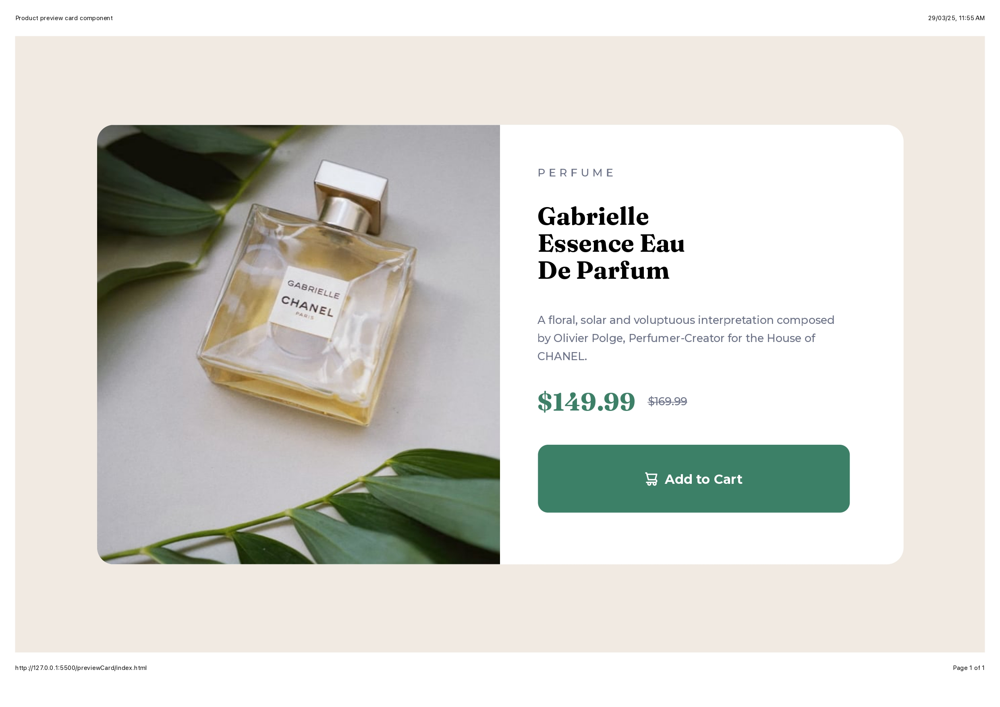

# Frontend Mentor - Product preview card component solution

This is a solution to the [Product preview card component challenge on Frontend Mentor](https://www.frontendmentor.io/challenges/product-preview-card-component-GO7UmttRfa).

## Overview

### The challenge

Users should be able to:

- View the optimal layout depending on their device's screen size.
- See hover and focus states for interactive elements.

### Screenshot



### Links

- Solution URL: [https://github.com/yourusername/product-preview-card-component](https://github.com/yourusername/product-preview-card-component)
- Live Site URL: [https://your-live-site-url.com](https://your-live-site-url.com)

## My process

### Built with

- Semantic HTML5 markup
- Flexbox
- Mobile-first workflow
- CSS custom properties

### What I learned

This project was a great way to practice my knowledge of **Flexbox** and creating responsive layouts. I learned how to properly align items using **Flexbox** to create a responsive card component that looks good on all screen sizes.

For example, I used `display: flex;` and `flex-direction: column;` for smaller screens to stack elements vertically, and for larger screens, I used `flex-direction: row;` to align elements horizontally.

```css
.container {
  display: flex;
  flex-direction: row;
  justify-content: center;
  align-items: center;
}

```
### Continued development

In future projects, I plan to continue experimenting with Sass and CSS custom properties (variables) to manage styles more efficiently and keep the code cleaner. I would also like to explore more advanced responsive design techniques.

### Useful resources

Scrimba Frontend Path - A great resource for structured learning in web development.

Udemy Angela Yu's Course - Excellent course for learning full-stack web development and diving deeper into HTML, CSS, and JavaScript.

### Author

Frontend Mentor - @MuskaanVash
